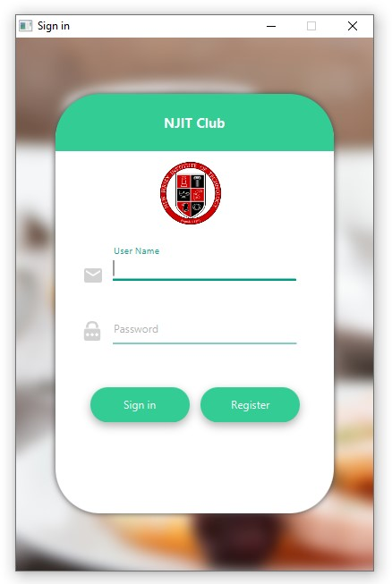
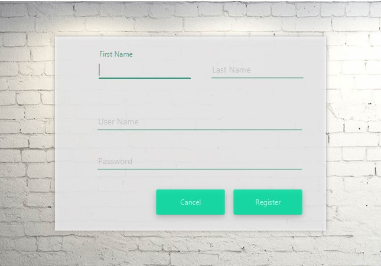
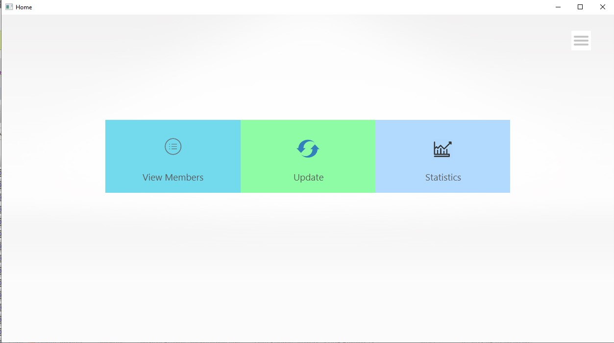
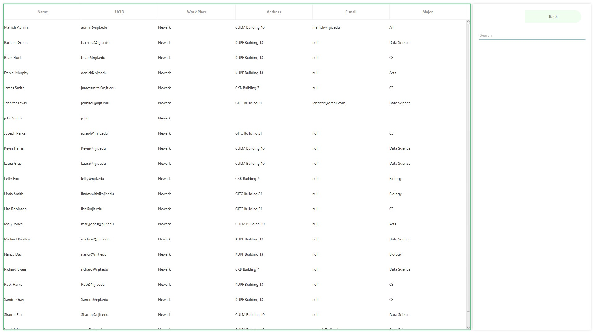
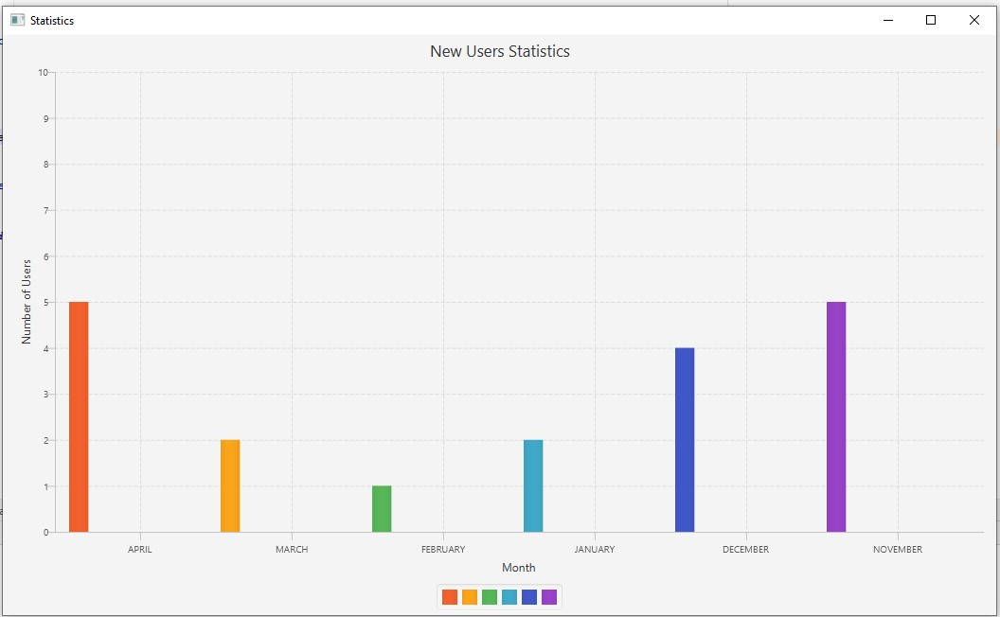

# Club-membership

This is a Club membership client-server application. Entire project is built on JavaFX which is a software platform to build desktop applications. It is written as Java API, so JavaFX application can reference APIs from any Java library. It uses FXML for creating user interface which is an XML-based declarative markup language.

## Description

It's an application which has two levels of access, User and Admin. Any individual can sign up for this with a ‘user’ access and only an existing admin can change a ‘user’ access to ‘admin’. A User can view all other users, change his/her information and can view the new users graph of his/her own ‘major’. An Admin can also update all other user’s information excluding the password. Graph generated for admin is collective new users irrespective of any field.

File tree
                                        
* Server classes:
                                        
	*	Main\ThreadedDataObjectServer.java	
	*	Main\DataObject.java				
	*	Main\Login.java						
                                        
* Client classes:                         
                                        
	*	M:\Club\src\Main\HomeMain.java		
	*	M:\Club\src\Main\Client.java		
	*	M:\Club\src\Main\Prop.java			
	*	M:\Club\src\model\UserModel.java	
	*	M:\Club\src\controller\HomeWindowController.java	
	*	M:\Club\src\controller\LoadingController.java		
	*	M:\Club\src\controller\NavAboutController.java		
	*	M:\Club\src\controller\NavHomeController.java		
	*	M:\Club\src\controller\SigninController.java		
	*	M:\Club\src\controller\SignupConroller.java			
	*	M:\Club\src\controller\SubStatisticsController.java	
	*	M:\Club\src\controller\SubUpdateAdminController.java
	*	M:\Club\src\controller\SubUpdateUserController.java	
	*	M:\Club\src\controller\SubViewController.java		

* Client fxml files:

	*	M:\Club\src\view\HomeWindow.fxml		
	*	M:\Club\src\view\Loading.fxml			
	*	M:\Club\src\view\NavAbout.fxml			
	*	M:\Club\src\view\NavHome.fxml			
	*	M:\Club\src\view\Signin.fxml			
	*	M:\Club\src\view\Signup.fxml			
	*	M:\Club\src\view\SubStatistics.fxml		
	*	M:\Club\src\view\SubUpdateAdmin.fxml	
	*	M:\Club\src\view\SubUpdateUser.fxml		
	*	M:\Club\src\view\SubView.fxml			

* CSS file:
	*	M:\Club\src\style\StyleSheet.css						

## Running the tests

Only need to start the server with:
* ThreadedDataObjectServer.java

### Screenshots

Sign in Page  

Sign Up Page  

Home Page  

All Members view  

All Members with realtime sorting  

All Members with realtime searching  

Members Update info  

No. of members graph  

Admin Update Page  

